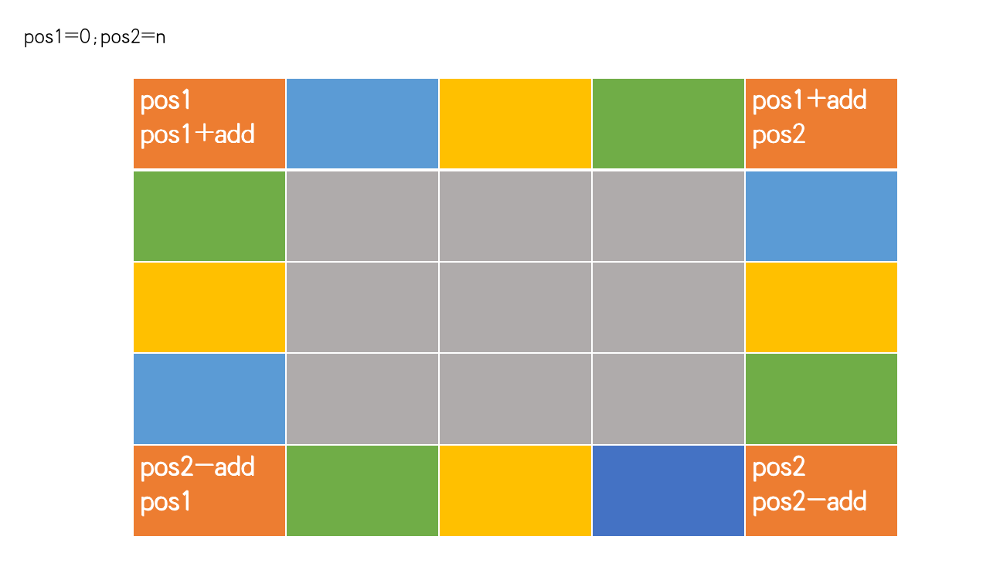
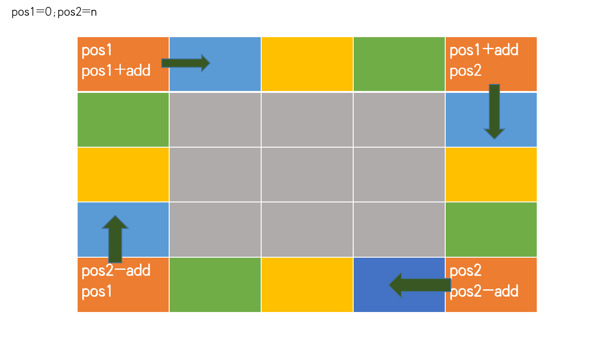

# Hot100
## 2021.1.22
## [48. 旋转图像](https://leetcode-cn.com/problems/rotate-image/solution/li-kou-48xiao-bai-du-neng-kan-dong-de-fang-fa-zhu-/)[Liu]
这题是一道矩阵旋转类型的题目，本质上是两数交换的高级版.并且矩阵问题有很深的应用，是很好的题。
下图以最外围为例，不同颜色的区块代表了需要置换的区域：



我们来寻找其中的规律，以四个角为例子，我们发现可以采用两个变量来表示四个角。顺时针方向分别是(pos1,pos1),(pos1,pos2),(pos2,po2),(pos2,pos1)。我们只要交换这四个角就可以完成这四个数的交换，之后我们需要一次遍历傍边的数，我们引入一个add来完成这个操作。由于pos1+add< pos2，我们找到了循环结束条件。



外圈循环结束之后，我们进入里圈。我们将pos1+1,pos2-1自然就进入了里圈。循环结束条件是pos1< pos2。
```python
def rotate(matrix):
    pos1,pos2=0,len(matrix)-1
    while pos1<pos2:
        add=0
        while add<pos2-pos1:
            temp=matrix[pos1+add][pos2]
            matrix[pos1+add][pos2]=matrix[pos1][pos1+add]
            matrix[pos1][pos1+add]=matrix[pos2-add][pos1]
            matrix[pos2-add][pos1]=matrix[pos2][pos2-add]
            matrix[pos2][pos2-add]=temp
            add+=1
        pos1+=1
        pos2-=1
# matrix=[[1,2,3],[4,5,6],[7,8,9]] demo1
matrix=[[ 5, 1, 9,11],[ 2, 4, 8,10],[13, 3, 6, 7],[15,14,12,16]]#demo2
print(rotate(matrix))
```

当然由于python的特性，我们也可以不要temp:
```python
def rotate(matrix):
    pos1=0
    pos2=len(matrix)-1
    while pos1<pos2:
        add=0
        while pos1+add<pos2:
            matrix[pos1+add][pos2],matrix[pos2][pos2-add],matrix[pos2-add][pos1],matrix[pos1][pos1+add]=matrix[pos1][pos1+add],matrix[pos1+add][pos2],matrix[pos2][pos2-add],matrix[pos2-add][pos1]
            add+=1
        pos1+=1
        pos2-=1
matrix=[[ 5, 1, 9,11],[ 2, 4, 8,10],[13, 3, 6, 7],[15,14,12,16]]
print(rotate(matrix))
```
但不建议这么写，一是可读性太差了，二是不利于调试。

## [75. 颜色分类](https://leetcode-cn.com/problems/sort-colors/)[Li]

```python
class Solution:
    def sortColors(self, nums):
        """
        #双指针
        p0=cur=0;p2=len(nums)-1
        while cur<=p2:
            #当nums[cur]=2时
            while cur<=p2 and nums[cur]==2:
                nums[cur],nums[p2]=nums[p2],nums[cur]
                p2 -= 1
            #当nums[cur]=0时
            if nums[cur] == 0:
                nums[cur],nums[p0]=nums[p0],nums[cur]
                p0 += 1
            cur+=1
        """
        #哈希map
        d = dict(Counter(nums))
        for s in [0,1,2]:
            if s not in d:
                d[s]=0
        for i in range(d[0]):
            nums[i]=0
        for j in range(d[0],d[0]+d[1]):
            nums[j]=1
        for k in range(d[0]+d[1],d[0]+d[1]+d[2]):
            nums[k]=2
```
## 2021.1.23
