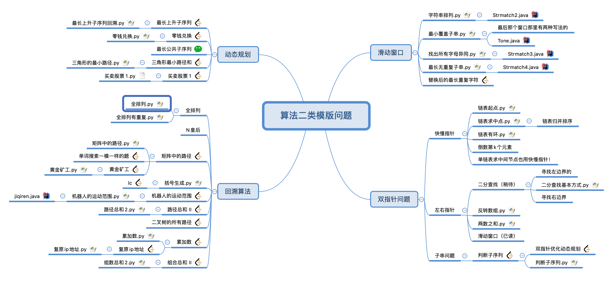
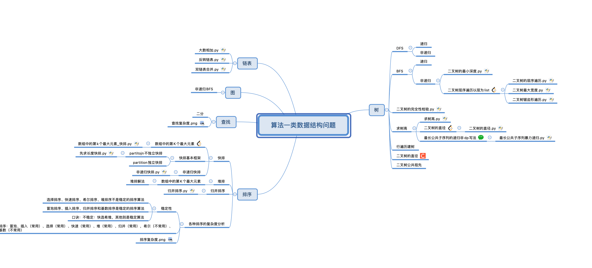
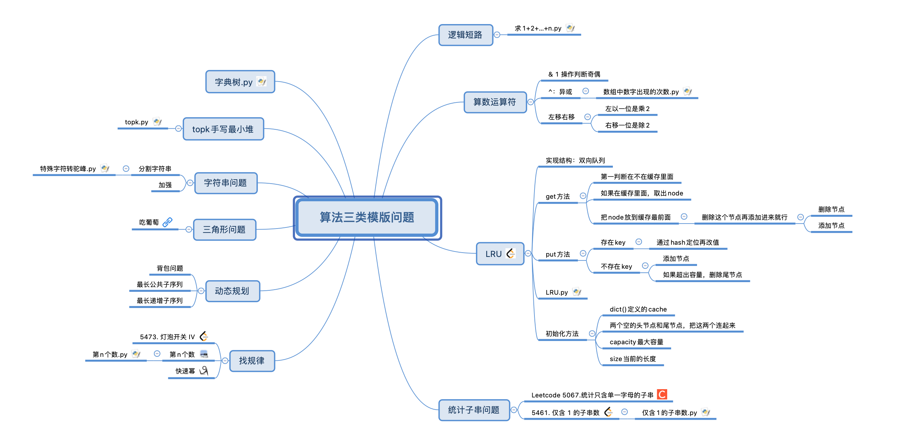

## 一 你可以获得什么？
### 1.**了解面试最新情况**
我会教你去年我面试遇到的最新情况，和为了应对这些情况所摸索出来的面试技巧。在21年秋招中，我已经历经了阿里，字节，美团，百度，腾讯，微软等基本所有国内外大厂招聘。最终拿到了虾皮(新加坡)，字节(北京)，和两个银行(杭州)的offer。由于跟你一样没人指导，我走了无数弯路，吃了无数苦头，屡战屡败之下，自认为已经知己知彼，又有一定的成功经验。而你将得到我这些得来不易的经验。

### 2.**学习合理刷题**
你将学会如何合理的刷题。在过去大半年里，为了找工作我研究刷题。我发现大多数人刷题方法是很成问题的。比如以为刷的多就有用，刷几百道题，全是简单题能有用？比如上来就刷，一题一题随机刷，第一天刷第二天就忘。再比如，刷一题不会一题，看一天题解，最后绝望放弃。这些问题太常见了，都是一开始没人指导导致的，而市面上大多数算法书和大神的教程说实话我觉得都很有问题。

## 二 为什么需要你
### 1.**我想要做一些尝试**
我大多时候是一个人学习和摸索。就刷题而言，我曾经尝试和同学结对学习，但没有达到我想要的效果，我想尝试一下教授学习的模式。
### 2.**需要更多的人来一起完善模版**
这个很难用一两句话说清楚，简单的说。由于市面上算法书大多停留在”题解”，”类型”这个浅层次上。我们需要自己去研究总结题型和模版，而一研究往往会涉及到多种路线的问题，人多可以加快我们得出最优模版的速度。
### 3.**最关键的，我需要有人跟我一起讨论**
我发现如果一个人去研究常常会遇到盲区，也就是我一个归纳出的东西有时候会不完善。我觉得充分的交流可以改善这一点。此外，由于我已经找好了工作，我缺乏一个近期的动力来驱动我，我希望通过讨论的方式可以让我形成正向激励。

## 三 希望你是怎么样的人
### 1.**最好是19级**
我相信一点，多数人只会做他不得不做的事。对于更小的学弟来说，刷题是一件有必要但不着急的事，我觉得这样的动力不足够。对于跟我同级的同学来说，我已经尝试过结伴学习的方式，我觉得教授学习的方式可能更加高效，而在这种方式中不适合同年交流。
### 2.**最好是男生**
还是上面那个观点导致。我认为大多数女生不太会从事需要刷题的工作，没有刷题的必要。没有任何歧视的意思，有合适的理由和强烈意愿的话女生也可以。
### 3.**有相同价值观**
3.1 ***可以接受用python刷题***

我觉得相比java,c而言python语法更简单，在白板编程中有一定优势，相比golang又有更多内置函数。为了方便代码级别细节上进行交流，最好统一用python。

3.2.***相信人是可以不断成长的***

人的”成功”绝不是靠”聪明”。自然而然的，你不喜欢给人贴标签，随意评判别人，你相信人是多元的。所以，你也对自己宽容以待。

3.3.***相信慢就是快***

慢工出细活。愿意一步一步脚踏实地慢慢走，拒绝”靠天吃饭”的赌运气行为或者寄希望于”大力出奇迹”盲目做事行为。

3.4 ***从来不轻易相信权威***

你从不放弃独立思考，并相信自己思考的逻辑和结论。你敢于在公开场合提出合理的质疑，并且相信自己可以在压力下表达出自己的观点。

3.5 ***有斗志***

虽然不是时时刻刻，但在做自己想做的事情时你充满活力，并且相信生活有时候会给你出乎意料的奖赏。

3.6 ***并不是一个荣誉感太强的人***

你会做一些没有明显收益,但是听上去有趣的事。你其实不太在意别人怎么看，不太在意外在的荣誉，多数情况下把自己内心的想法作为动力。

## 四 我们怎么合作
### 1.**为什么是两个**

我觉得三个人是一个很好的小团体形式。既不会人太多，导致达成一致的交流成本过高。也不会人太少缺少仪式感，导致不得不扯闲篇，浪费交流时间。

### 2.**交流时间**

我觉得每周一到周四当面交流，每天一个小时左右比较合适。前期可能我说的多，后期各二十分钟比较妥当。原则是少即是多，慢就是快。问题讨论的少没关系，研究明白清晰很关键。平时可以微信交流。最大程度不打扰正常生活的情况下，取得最佳效果。

### 3.**一起研究各自训练**

我认为算法分为研究和训练。研究前面讲了很多，但通过研究出来的方法指导自己进行训练更加关键。要知道，真实面试中，需要在30分钟内白板编程，且尽量用最优方法输出正确结果。不仅需要快速找到合适解题路径，更要学会快速编码不出错。因此我们要熟练掌握各种研究出来的算法模型，训练得像呼吸一般自然。我倾向于研究时交流，自己对自己进行训练。

### 4.**尝试期**

本学期结束时间是1月23号，我们有3周左右尝试机会。我们将以周为单位决定下一周是否有必要继续。每周最后一天，我们需要开诚布公的说出在这一周的观察，对其他两位成员说出一个问题，和一个你发现的优点(值得夸，值得学习)。除此以外，我们在任何时候都要尽量避免对其他成员的批评。禁止相互比较谁刷题更厉害这种无聊的行为，互相比较除了让人焦虑，无济于事。

## 五 这将是一次有趣的尝试

不确定有没有人来找我，也不确定组成了之后会不会有效果，更无法确定这个形式是不是能持续。我能确定的是，在越来越内卷化的今天，我相信国内互联网的面试将有接轨硅谷的趋势。即放弃寻找”天才”，转向以解题为核心，选拔出人群中愿意努力刷题，且大概率不蠢的”凡人”。这将是一次有益尝试。无论什么结果，因上努力，果上随缘。如果你也相信这个趋势，请发简历(如果有的话)邮件到liuzehao139@163.com，期待我们一起进步！

## 以下内容为我所准备的材料:
1.为了第一周所编写的资料，[回溯算法](./backtracking.md)

2.算法脑图

